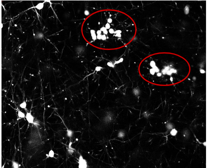
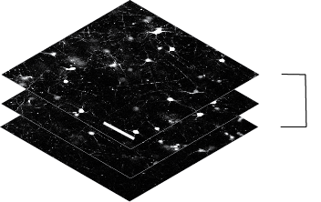
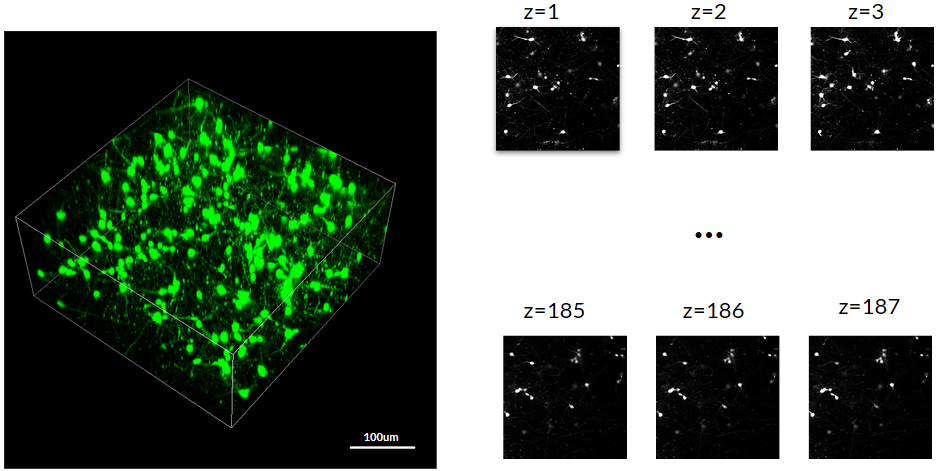
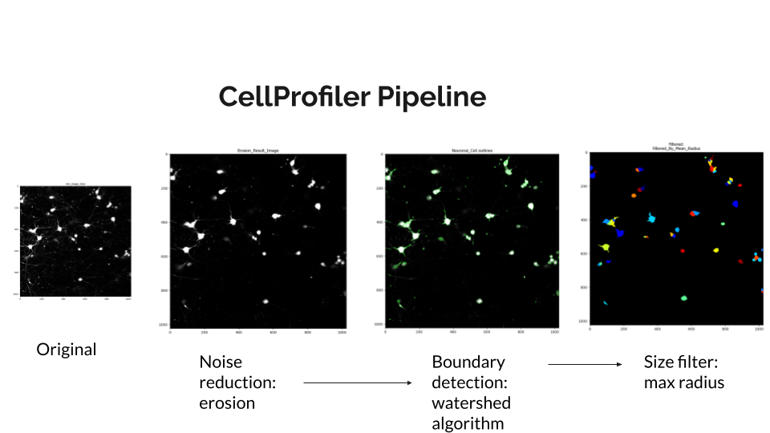
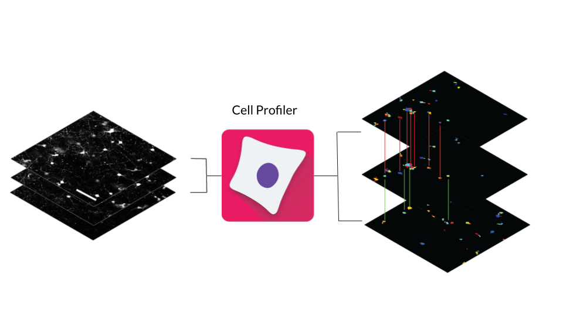
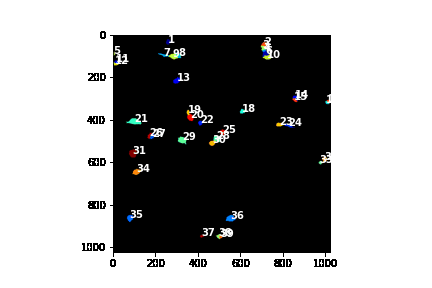
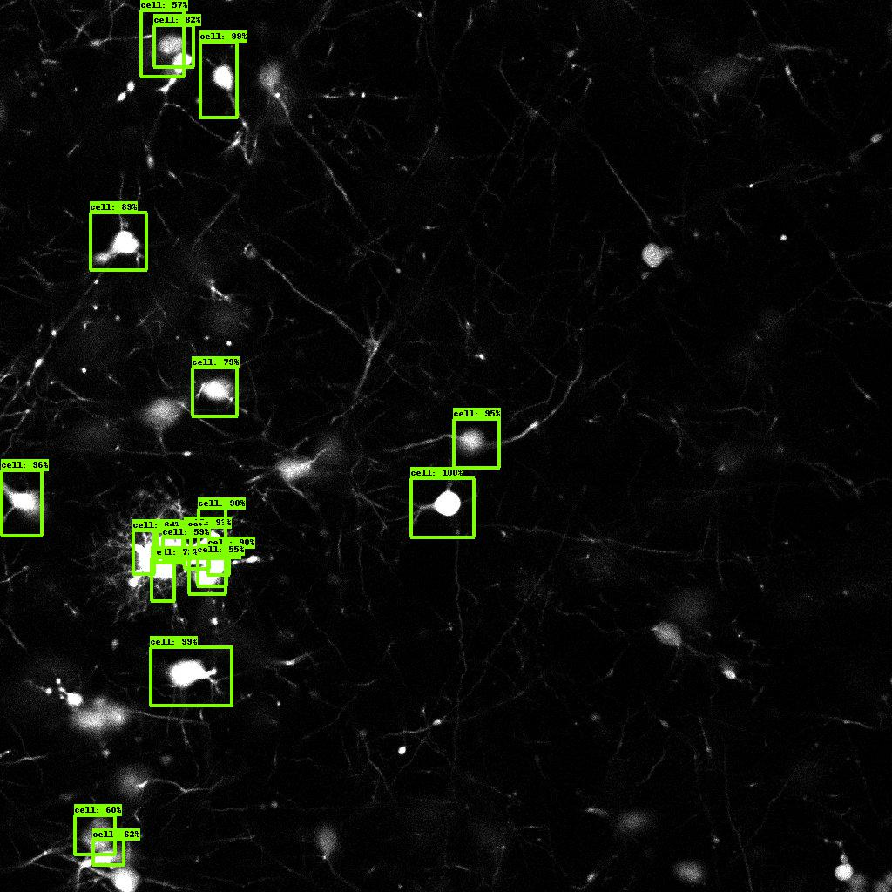
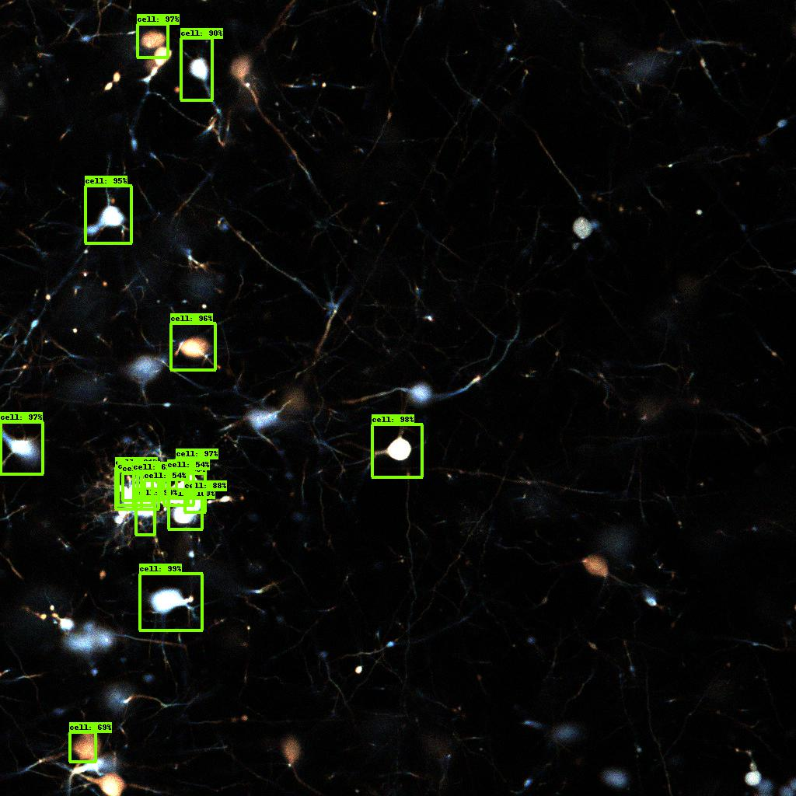
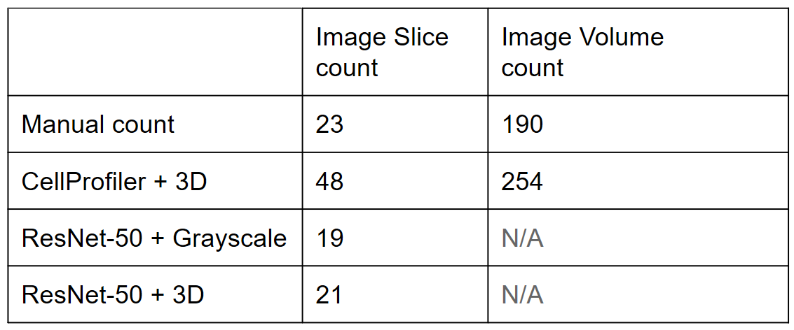

Automated cell cluster detection and segmentation
=======================================

## Page URL
[https://weiyuzh.github.io/CS766-Project/](https://weiyuzh.github.io/CS766-Project/)

## CS 766 Project: Automated cell cluster detection and segmentation
Group Members:
- Nomin Khishigsuren
- Roy Sun
- Trevor Zachman-Brockmeyer
- Weiyu Zhang

## Proposal
[https://weiyuzh.github.io/CS766-Project/proposal.html](https://weiyuzh.github.io/CS766-Project/proposal.html)

## Midterm Report
[https://weiyuzh.github.io/CS766-Project/midterm.html](https://weiyuzh.github.io/CS766-Project/midterm.html)

# **Motivation**
Cell detection and counting is fundamental in biomedical and cancer research and it is regarded as the basis of image-based cellular research. Cell counting can be perfomed manually using a hemocytometer, flow cytometry or simply by hand-counting from images taken with the microscope. Manual hand-counting is the most affordable option, yet it is very time-consuming and is often subject to bias of the observer1. These drawbacks are often exarcebated by the complexity of cell structures that could lead to detection ambiguity and poor image quality for 3D volumetric images that is usually constrained by the specs of the microscope that is being used. 

To overcome these obstacles, a great number of methods and approaches have been developed to detect and count cells automatically using image processing algorithms.  Although these softwares and tools prove to be faster and more robust method to get a cell count from microscope images, many still show limitations when it comes to analyzing a cluster of cells that are in close proximity, and in 3D culture environments2. Therefore, our two main areas of focus were: 

- ### Clusters containing multiple cells 

Due to the complexity of the cell structures in 3D *in-vitro* culture environments, multiple cells are found clustered into a single blob. A lot of tools don't segment these clusters correctly which leads to inaccurate cell counts. 

  

- ### Using z-stacks to detect neighboring cells 

Volumetric images are obtained by acquiring 2D images along the z-dimension or height of the sample. Using the information that the z-stacks provide, it is possible to determine vertically adjacent/neighboring images and infer additional information about each image (e.g. two disjoint but closeby cells in one image may appear as a single blob in the neighboring image). 

  

As part of this project, we reviewed existing methods and explored image processing enhancements for cell detection, segmentation and counting. Our interest lied in the potential of developing a method that factors in the 3D nature of cells in the image processing and cluster analysis. 

# **Our Dataset**
The dataset we used for our project is a 3D volumetric image of neurons which is obtained by acquiring 2D image slices at different heights z, taken with a multiphoton microscope. For the image dataset shown, it had 187 cross sectional 2D images that were stacked together to create the 3D volumetric image.   
 

[Raw Images](https://github.com/weiyuzh/CS766-Project/tree/main/docs/csv_analysis/original_images)

# **Method #1: The Graph-Cut Algorithm**
The first algorithm we explored was a graph-cut algorithm highlighted in a paper4 from the 2012 IEEE conference. The main intuition is straightforward: cells typically exhibit an ellipsoid shape. We can exploit this pattern to guide our cut and at the same time help reduce computational complexity. The specific equation used is below. 
 

The graph-cut itself is done by locating the nuclei of cells and expanding the nuclei through a vector field. The detection of the nuclei is inspired by another paper that uses multiscale products to detect locations of interest. We calculate Hessian eigenvalues at different pixels p and with different smoothness scale σ to form connected components within the image. Each connected component acts as the seed of an individual cell. We then use an input diameter to "grow" the seeds via Euclidean distance from each individual seed's center and taking its gradient. 
 

The results on an individual cell image can be seen below. The algorithm did well when working with isolated cells of various sizes, but struggled with clusters of cells. The ellipsoid nature of the algorithm backfired here because we do not restrict the growth to a strict shape and instead allow it to form a "blob-like" pattern. Thus, the algorithm cannot distinguish those clusters as individual cells. While we could change the input diameter to accomodate these clusters, the change would also negatively affect detection on isolated cells. 

In addition, this algorithm could only take 2D inputs, which defeated the purpose of making use of the z-stacks information for our analysis. Thus, we moved on to other methods that were more compatible with our dataset and aligned with our goals.

# **Method #2: CellProfiler**

CellProfiler is an image analysis software for identifying and quantifying cells. This software was appealing to us for numerous reasons3:

- #### Contains already-developed methods and advanced algorithms for image analysis 
- #### Provides flexible, open-source platform with easily adjustable modules and pipelines 
- #### Measures and outputs the size, shape, intensity and texture of a variety of cell types.

CellProfiler has many image analysis techniques, however the ones that were most beneficial to us were erosion, boundary detection, and size filtering modules. First, to remove the cluttered background noise of the image, erosion was used. This made the background more uniformly black and the cells more uniformly white. Next, we detected boundaries around and between cells using CellProfiler’s boundary detection module. Looking through CellProfiler’s source code showed that the software used the Watershed algorithm to detect boundary edges. Lastly, using CellProfiler’s size filter module, we filtered out cells whose max radius was smaller than some predefined threshold.

After the use of the CellProfiler pipeline, we now had a stack of 2D images with clearly defined cells in each slice. However, in order to get an accurate count of cells in the entire 3D space, some sort of algorithm would need to be used to link cells between the 2D slices. This is needed because individual cells span across multiple slices, and simply counting the cells in each slice would overcount due to duplicates showing up in neighboring slices.

In order to match cells across slices, 3-D Euclidean distance was used. Each cell’s centroid in every slice was assigned a coordinate value of x, y, and z. Using the centroid coordinates and calculating euclidean distances between neighboring slices resulted in cells being marked as equivalent if the distance between their centroids was less than some predefined threshold. This would hopefully solve the overcounting problem because cells would maintain their identity through the 3 dimensional image space.

These are the results of the Euclidean distance formula. We overlayed the calculated cell labels on top of both the filtered image stack generated by CellProfiler as well as on top of the original cell image slices. When a new cell appears, it is assigned a new ID. However, if a cell persists through multiple slices, it retains the same ID that was assigned to it in a previous slice.

Overall, the customized CellProfiler pipeline combined with 3-D Euclidean distance measure works fairly well. However, one flaw in this pipeline is that overcounting still occurs. This is primarily due to CellProfiler's Watershed algorithm oversegmenting clusters of cells. For example, a hand counted ground truth cluster consisting of 8 cells could be overcounted to as much as double that original number. Each of these segmented cells then have a centroid present in the Euclidean calculation, making it difficult to tell which should be counted and which should be ignored. Tweaking Euclidean distance parameters could help alleviate this overcounting slightly, however changing the parameters too much negatively impacts the counting of cells that are either isolated or that are in smaller, loosely packed groups of only 2 to 3 cells. Further research and experimentation into CellProfiler's Identify Primary Objects module would be key to reducing the over-segmentation problem as well as the over-counting problem that this pipeline faces.

# **Method #3: Machine Learning**

## Grayscale
In addition to the above methods, we briefly investigated identifying cells using convolutional neural networks. We started simple, with 18 manually labelled images as the training data set and a ResNet-50 pipeline. Using TensorFlow and Google Colab, we first trained our model using grayscale images and evaluated our model against the full sample dataset. Shown below are all cells that were detected with > 50% confidence.

[Notebook](https://github.com/weiyuzh/CS766-Project/blob/main/Machine%20Learning/Cell%20Counting%20Grayscale/Cell%20Counting%20Grayscale.ipynb)  
[Pickled Training Data Bounding Boxes (Every 10th Image)](https://github.com/weiyuzh/CS766-Project/blob/main/Machine%20Learning/Cell%20Counting%20Grayscale/gt_boxes_nomin)  
[Individual Frames](https://github.com/weiyuzh/CS766-Project/tree/main/Machine%20Learning/Cell%20Counting%20Grayscale/gif_frames)  
[Pipeline Config](https://github.com/weiyuzh/CS766-Project/tree/main/Machine%20Learning/Cell%20Counting%20Grayscale/checkpoint/new_config)  
[Checkpoint Restore](https://github.com/weiyuzh/CS766-Project/tree/main/Machine%20Learning/Cell%20Counting%20Grayscale/checkpoint)  

## Multichannel

We then looked at if having vertical correlations (in the form of neighboring horizontal slices) would impact predictions made by a ResNet-50 pipeline. We took three consecutive images and combined them into one multichannel composite (each channel is represented as Red/Green/Blue channels in visualizations) and trained another ResNet-50 pipeline using similar manually labelled images. Shown below are all cells that were detected with > 50% confidence.

[Notebook](https://github.com/weiyuzh/CS766-Project/blob/main/Machine%20Learning/Cell%20Counting%20Multichannel/Cell%20Counting%20Multichannel.ipynb)  
[Pickled Training Data Bounding Boxes (Every 10th Image)](https://github.com/weiyuzh/CS766-Project/blob/main/Machine%20Learning/Cell%20Counting%20Multichannel/gt_boxes_nomin)  
[Individual Frames](https://github.com/weiyuzh/CS766-Project/tree/main/Machine%20Learning/Cell%20Counting%20Multichannel/gif_frames)  
[Pipeline Config](https://github.com/weiyuzh/CS766-Project/tree/main/Machine%20Learning/Cell%20Counting%20Multichannel/checkpoint/new_config)  
[Checkpoint Restore](https://github.com/weiyuzh/CS766-Project/tree/main/Machine%20Learning/Cell%20Counting%20Multichannel/checkpoint)  

Qualitatively, the multichannel model converged with less training and was generally able to detect overlapping cells with higher confidence than the grayscale model.

# Comparison

We manually hand-counted the cells in the volumetric image shown in the dataset section, and used that value as the basis and the ground truth for the comparison of the CellProfiler and Machine learning methods and their cell counting accuracy. These values correspond to the **Image Volume count** column. 

We also wanted to compare the methods on how accurately they counted cells in a single image slice. Slice 48 was chosen for this comparison due to a big cluster that was visible and we wanted to test the methods to see whether they would count the cells in the cluster correctly. The values that were obtained correspond to the **Image Slice count**. 

Looking at the table, we can see that the CellProfiler overcounted in both cases possibly due to the Watershed boundary algorithm's tendency to over-segment the cells. ResNet-50 on the other hand, more specifically ResNet-50 + 3D provided a cell count that was surprisingly close to the ground truth with an 8.7% error for an image slice. However, CellProfiler was able to count cells in the 3D volume and was therefore more robust than ResNet methods due to its incorporation of the z-stack information.    

# **Future Improvements**

Although we were able to get a cell count with ResNet for 2D slice image, and modified CellProfiler method for both 2D slice and 3D image, it was still pretty inaccurate possibly due to a number of reasons which we think can be further improved. 

- Fine-tuning and optimizing parameters of the CellProfiler Watershed algorithm
- Optimizing thresholds for 3D Euclidean distance calculations
- Training and evaluating methods with larger image datasets 

First of all, we noticed the tendency for the Watershed algorithm to over-segment cell clusters and we think we can improve this by optimizing the parameters of the algorithm.
Secondly, to better incorporate neighboring slices to the cell count, optimizing the thresholds and parameters for the 3D Euclidean distance is optimal. For Resnet specifically, we think we can achieve ground truth accuracy with more training image datasets and similarly for CellProfiler, as using more image datasets could help improve fine-tuning the values for the parameters that give higher cell count accuracy.

**Finally, we think delving into cellular image analysis has been insightful for all of us and we were able to showcase and compare the performances of multiple softwares and techniques that are currently used in biomedical and cancer research. Of course, implementing these methods are not so straight-forward and they often lack in the analysis of 3D volumetric images. We came up with a way to count cells in 3D volumetric image by using their 2D image analysis capabilities but observed that much depended on fine-tuning variables and parameters of the algorithms they used. Machine learning algorithms like ResNet performed better in 2D slice images and seems promising. A key takeaway for us for this final project was that there is no easy solution to segment and count cells as seemingly simple as it sounds.**  

# Presentation Recording
[Link to Presentation Recording](https://github.com/weiyuzh/CS766-Project/blob/main/docs/Automated%20cell%20cluster%20detection%20and%20segmentation.mp4?raw=true)

# **References**
1: [O'Brien J, Hayder H, Peng C. Automated Quantification and Analysis of Cell Counting Procedures Using ImageJ Plugins. J Vis Exp. 2016 Nov . doi:10.3791/54719. PMID: 27911396; PMCID: PMC5226253](http://europepmc.org/article/PMC/5226253).

2: [1.Schmitz, C. et al. Current automated 3D cell detection methods are not a suitable replacement for manual stereologic cell counting. Frontiers in Neuroanatomy 8, 27 (2014)](https://www.frontiersin.org/articles/10.3389/fnana.2014.00027/full).

3: [Carpenter, A.E., Jones, T.R., Lamprecht, M.R. et al. CellProfiler: image analysis software for identifying and quantifying cell phenotypes. Genome Biol 7, R100 (2006). https://doi.org/10.1186/gb-2006-7-10-r100](https://genomebiology.biomedcentral.com/articles/10.1186/gb-2006-7-10-r100#citeas)

4: [Learning to Segment Dense Cell Nuclei with Shape Prior](https://citeseerx.ist.psu.edu/viewdoc/download?doi=10.1.1.471.5473&rep=rep1&type=pdf)
