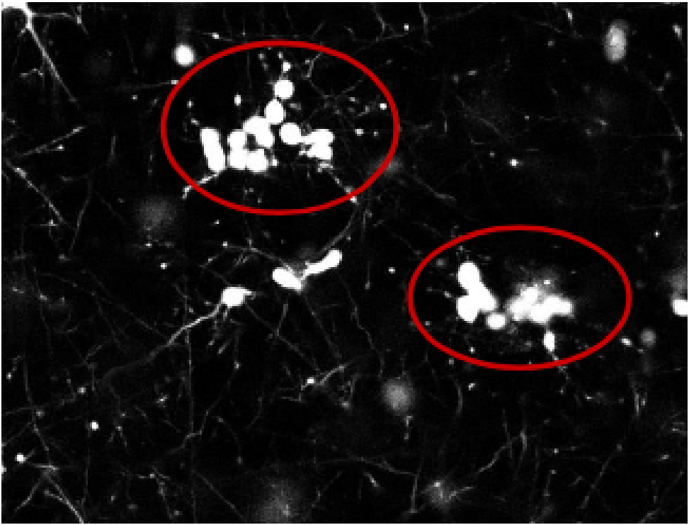
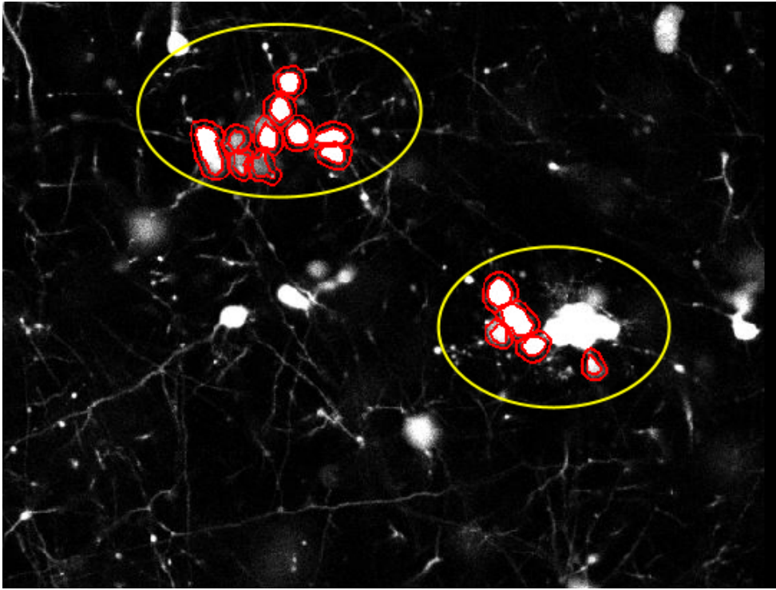

## Page URL
https://weiyuzh.github.io/CS766-Project/proposal.html

## CS 766 Project: Cluster Analysis on Neural Cell Imaging
Group Members:
- Nomin Khishigsuren
- Roy Sun
- Trevor Zachman-Brockmeyer
- Weiyu Zhang

## Briefly explain what problem you are trying to solve.
Cell recognition and quantification are fundamental skills in life sciences. Delineating between different cell types and establishing accurate measurements of cell density have applications in both research and treatment contexts (e.g. white blood cell counts). Historically, automated cell counting methods involve measuring electrical or refractive features of cells. However, recent advancements have made it possible to classify and quantify cells using image analysis. 

As part of this project, we will review existing methods and explore new enhancements for cell classification and counting via image processing. We have images of neuronal cells to use as a sample dataset and corresponding manually labelled images to serve as the ground truth. Currently, we plan to explore two major directions:

1) Due to the nature of these cells and the imaging acquisition process, multiple cells can be clustered into a single object (see Fig 1). We need to correctly distinguish between single cells versus clusters of cells to establish an accurate cell count. We will recreate and apply existing algorithms for doing so and test potential enhancements along the way.

2) Images in the sample dataset are linked vertically. That is, each image is a horizontal slice of the 3D culture, and we have the vertical ordering of these images available. Using this information, we can determine vertically adjacent/neighboring images and infer additional information about each image (e.g. two disjoint but closeby cells in one image may appear as a single blob in the neighboring image). To the best of our knowledge, existing algorithms do not account for this correlation. We will investigate if these cross-image correlations are useful for cell counting purposes.

Fig 1. 2D slice of 3D image of neuronal cells showing cells in clusters

## Why is this problem important? Why are you interested in it?
The research field of automated image analysis of cells and tissues have attracted a lot of attention in recent years due to interests in using developments in technology and image processing capabilities to tackle issues that are often encountered in biomedical imaging. One such problem is cell segmentation; much still relies on manual segmentation by hand which shows that there is a need for a more accurate, robust and adaptable method without having to rely on the input of the observer. 

Although a great number of methods and approaches have been developed that count and segment cells automatically, many still show limitations when it comes to analyzing a cluster of cells that are in close proximity, and in 3D culture environments. Because the images that we will be analyzing are 3D volume stacks of neuronal cells that were stained with a fluorescent marker and imaged with a microscope, our interest lies in the potential of developing a method that factors in the 3D nature of cells in the image processing analysis. 

## What is the current state-of-the-art?
One of the current state-of-art techniques for biomedical image segmentation is U-Net. U-Net is a deep convolutional network that models relationships between input and target images by extracting a large number of features and propagating the information to higher resolution layers. While our approach will not include machine learning algorithms or a deep learning network, we plan to eventually compare our results with this method. 

One of the most commonly used software for basic counting and segmentation purposes is ImageJ. With the option to install external plugins to the software, it has been widely popular with scientists and researchers in the biomedical field due to its versatility and friendly user interface. However, their 3D cell counter and segmentation lacks the ability to handle complex cases where cells are joined together. 

Our approach aspires to be something in between these two methods, an improvement on the basic threshold-based and feature-extraction-based approaches by taking into account the images of the cells at different layers or slices.

At the same time, we are also researching other popular methods. These other methods include:
- Qupath, a Java BioImage Analysis software
- OpenCV, a Python computer vision library
- Neuron Studio, a neuron tracing program

## Are you planning on re-implementing an existing solution, or propose a new approach?
Our plan is to find an existing solution that could be adapted and re-implemented for our analysis. Overall, we plan to find a solution for counting neuronal cells using images similar to those in our dataset. As a result, we can make additional assumptions based on attributes specific to our dataset.

We plan on to start with reimplementing existing solutions. In this phase, we will explore current capabilities and determine areas where improvements specific to counting neuronal cells can be made. We will incorporate these enhancements to generate more refined cell counting algorithms. If time permits, we will explore potential machine learning solutions to analyzing images similar to those in our dataset.

Some existing solutions that we may base our research on include classic image processing algorithms such as object recognition, noise filtering, area counting, and edge detection. While these constitute a good starting point for the design of our cell cluster detector, we will also explore any other image processing techniques that would help in the detection, segmentation, and accurate counting of these neuronal cell clusters.

Along with the above existing solutions, there may be other helpful algorithms that would aid us in our stretch goal of reconstructing the 3-D image represented by the individual slices. In particular, focusing on panorama construction algorithms and fine tuning them to our specific neuronal cell images could be an especially useful path to take.

## If you are proposing your own approach, why do you think existing approaches cannot adequately solve this problem? Why do you think your solution will work better?
Fig.2 shows how QuPath, one of the softwares used for biomedical imaging analysis, fails to recognize one of the blobs as two cells and ignores the bigger cluster of cells completely. 

While the existing approaches are great computer vision tools, they were not built with neuron cluster detection in mind. And various characteristics of cell imaging makes it difficult for these conventional approaches to accurately capture the desired information. 

Fig 2. The failure of QuPath software to detect and count the same cluster of cells

## How will you evaluate the performance of your solution? What results and comparisons are you eventually planning to show? Include a time-line that you would like to follow.
We have a set of over 50 neuron cell cluster images for testing purposes. First, we will manually identify the correct number of neuron clusters for each image. Then, we will run both the conventional tool(s) that we listed out earlier and our own solution(s) to detect the number of neuron clusters in our sample set. 

We can quantitatively measure the error of each method by seeing how many images were identified with the correct number of clusters. We will also take into account how “close” the miscounts are, so methods that were off by only one cluster will be evaluated more favorably than ones that completely missed the count. 

Finally, if time permits, we could train a deep learning model on our images and compare the accuracy of the machine learning framework to our purely image processing based approach. The results of this accuracy comparison could give some insight into the advantages or disadvantages of extending our research into machine learning based detection models. 

## Timetable

|Date|Milestone|
|----|---------|
|February 24|Initial proposal|
|March 3|Review existing algorithms and software packages|
|March 10|Investigate initial enhancement options|
|March 17|Implement first round of changes|
|March 24|Midterm report, analyze outcomes from first round of changes|
|March 31|Second iteration of enhancements|
|April 7|Finalize second round of improvements|
|April 14|Final comparison with state of the art methods|
|April 23|Final presentation|
